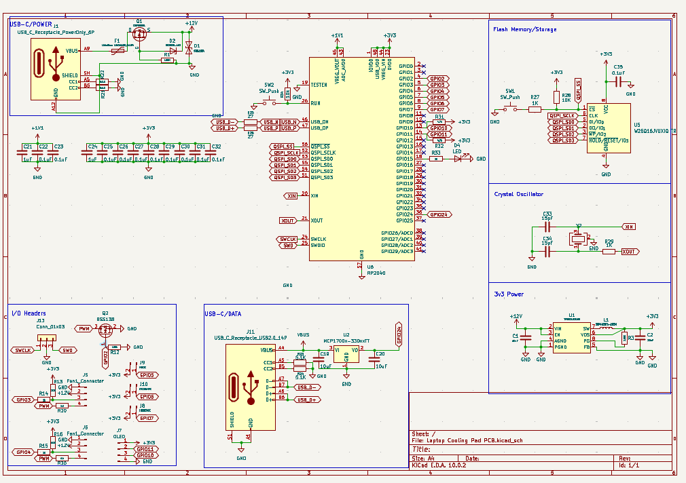
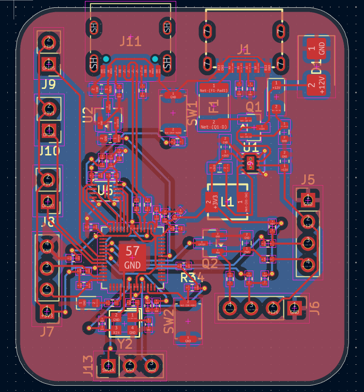
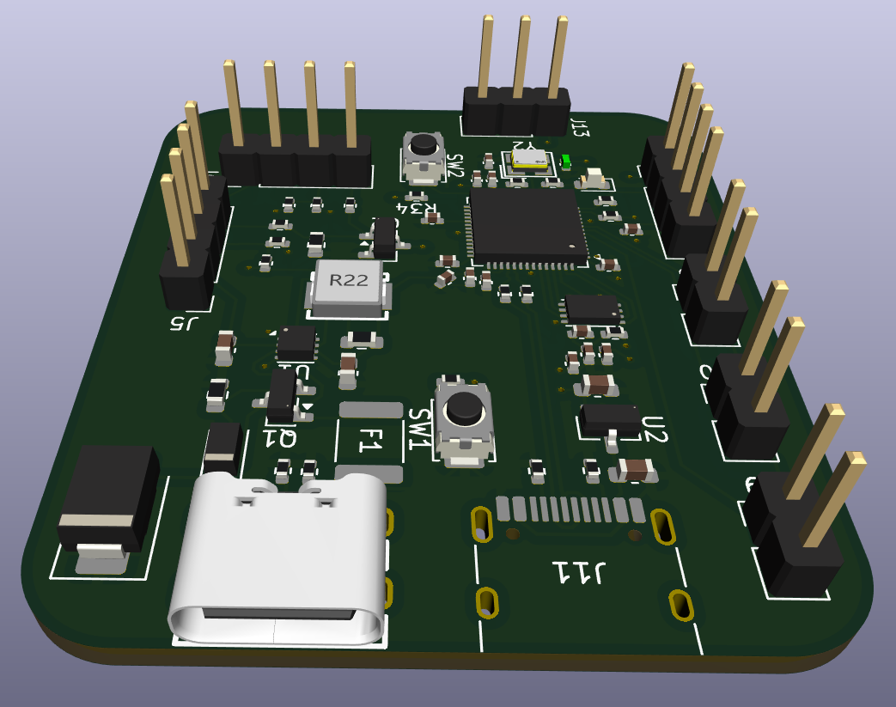
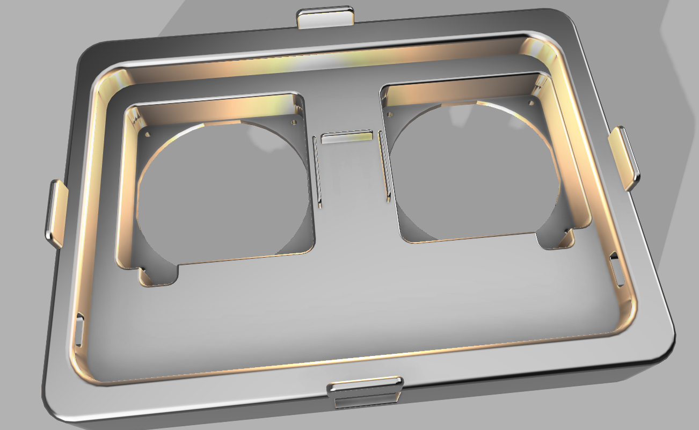
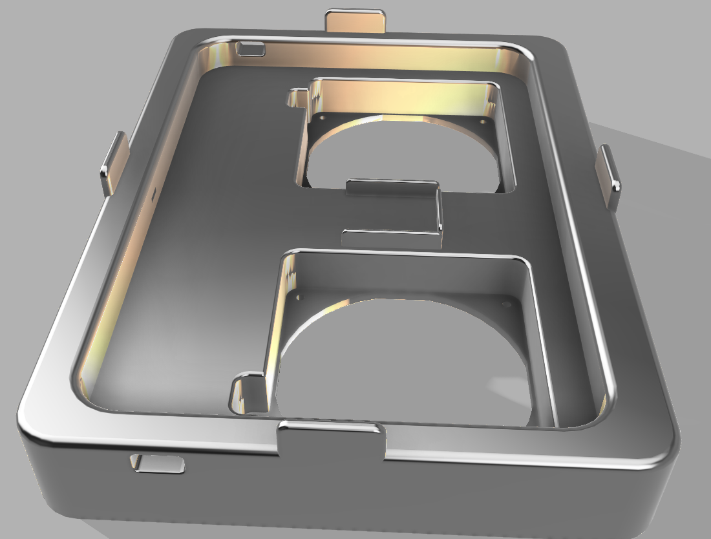
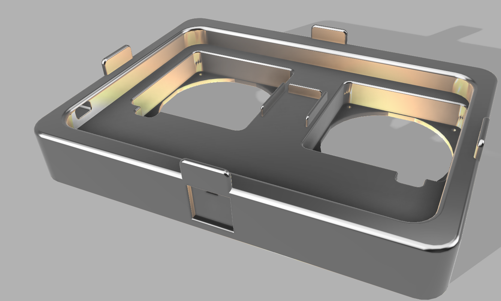
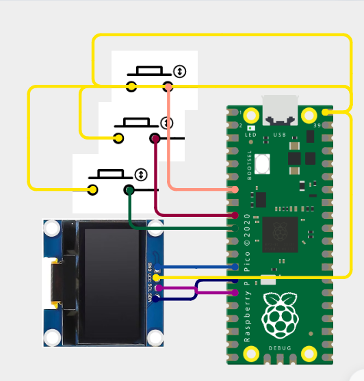

# 3D Printable Laptop Cooling Pad

This is an open source laptop cooling pad designed to force air into the laptop like the Ilano V10 Cooling Pad. It uses 2 Arctic P12 Pro fans set in back portion of the cooling pad instead of th emiddle as most laptops have ducts at the back and not in the middle. It also uses a custom RP2040 based board to control the fan speed on the basis of the temperature of the CPU if in automatic mode or to set the fans to a constant speed if in manual mode. It requires a seperate 12v Power Input to run it without increasing load on the laptop by using the laptop to supply power to it. If it is to be  used in automatic mode then it should be connected to the laptop by a seperate cable so that the laptop can provide it with the CPU temperatures.

## Instructons for Using and Assembly

1. Attach the PCB to the area enclosed by 3 thin walls in between the fan. The PCB should slip in and sit snugly in the enclosure as it has been built to the exact dimensions for the pcb.

2. If you plan on using only manual mode then connect the 6 pin usb c receptacle to an external 12V Power Supply. The 6 pin USB C receptacle is the one on the right of the RP2040 chip.

3. If you wish to use automatic mode as well then attach a cable from any port of the computer to the 14 pin usb c receptacle present straight ahead of the RP2040 chip.

4. The OLED scrren will show current mode, fan speed and if any fan is facing any errors. If it is in automatic mode then it will also show the CPU temperature which will be updated once every 5 seconds.

5. You can use the Increase/ Decrease Buttons to increase or decrease the RPM of the fan by 500 in Manual Mode.

6. You can use the Mode Button to toggle the Mode of the Cooling Pad.

## Schematic

## PCB

## 3D-Design

## External Circuit

## BOM

 **#** | **Reference**                               | **Qty** | **Value**                     | **DNP** | **LCSC Part Number** | **Exclude from BOM** | **Footprint**                                               | **Datasheet**                                                                    
-------|---------------------------------------------|---------|-------------------------------|---------|----------------------|----------------------|-------------------------------------------------------------|----------------------------------------------------------------------------------
 1     | C1,C19,C20                                  | 3       | 10uF                          |         | C96446               |                      | Capacitor_SMD:C_0603_1608Metric                             |                                                                                  
 2     | C2                                          | 1       | 22uF                          |         | C2762594             |                      | Capacitor_SMD:C_0603_1608Metric                             |                                                                                  
 3     | C21,C24                                     | 2       | 1uF                           |         | C52923               |                      | Capacitor_SMD:C_0402_1005Metric                             |                                                                                  
 4     | C22,C23,C25,C26,C27,C28,C29,C30,C31,C32,C35 | 11      | 0.1uF                         |         | C1525                |                      | Capacitor_SMD:C_0402_1005Metric                             |                                                                                  
 5     | C33,C34                                     | 2       | 15pF                          |         | C86285               |                      | Capacitor_SMD:C_0402_1005Metric                             |                                                                                  
 6     | D1                                          | 1       | SMBJ15A                       |         | C83846               |                      | Diode_SMD:D_SMB                                             |                                                                                  
 7     | D2                                          | 1       | BZT52H-A12                    |         | C7507853             |                      | Diode_SMD:D_SOD-123F                                        |                                                                                  
 8     | D4                                          | 1       | LED                           |         | C965804              |                      | LED_SMD:LED_0603_1608Metric                                 |                                                                                  
 9     | F1                                          | 1       | Littelfuse 1812L150/24MR      |         | C142805              |                      | Fuse:Fuse_1812_4532Metric                                   |                                                                                  
 10    | J1                                          | 1       | USB_C_Receptacle_PowerOnly_6P |         | TYPE-C 6P(073)       |                      | easyeda2kicad:TYPE-C-SMD_TYPE-C-6P-073                      | https://www.usb.org/sites/default/files/documents/usb_type-c.zip                 
 11    | J5,J6                                       | 2       | Fan1_Connector                |         | C2691448             |                      | Connector_PinHeader_2.54mm:PinHeader_1x04_P2.54mm_Vertical  |                                                                                  
 12    | J7                                          | 1       | OLED                          |         | C2691448             |                      | Connector_PinHeader_2.54mm:PinHeader_1x04_P2.54mm_Vertical  |                                                                                  
 13    | J8                                          | 1       | INCREASE                      |         | C32713268            |                      | Connector_PinHeader_2.54mm:PinHeader_1x02_P2.54mm_Vertical  |                                                                                  
 14    | J9                                          | 1       | MODE                          |         | C32713268            |                      | Connector_PinHeader_2.54mm:PinHeader_1x02_P2.54mm_Vertical  |                                                                                  
 15    | J10                                         | 1       | DECREASE                      |         | C32713268            |                      | Connector_PinHeader_2.54mm:PinHeader_1x02_P2.54mm_Vertical  |                                                                                  
 16    | J11                                         | 1       | USB_C_Receptacle_USB2.0_14P   |         | C165948              |                      | Connector_USB:USB_C_Receptacle_HRO_TYPE-C-31-M-12           | https://www.usb.org/sites/default/files/documents/usb_type-c.zip                 
 17    | J13                                         | 1       | Conn_01x03                    |         | C2937625             |                      | Connector_PinHeader_2.54mm:PinHeader_1x03_P2.54mm_Vertical  |                                                                                  
 18    | L1                                          | 1       | SRP4020TA-2R2M                |         | C719179              |                      | easyeda2kicad:IND-SMD_L4.5-W4.1_SRP4020TA                   |                                                                                  
 19    | Q1                                          | 1       | DMP3099L                      |         | C2940610             |                      | Package_TO_SOT_SMD:SOT-23                                   | https://ngspice.sourceforge.io/docs/ngspice-html-manual/manual.xhtml#cha_MOSFETs 
 20    | Q2                                          | 1       | BSS138                        |         | C52895               |                      | Package_TO_SOT_SMD:SOT-23                                   | https://www.onsemi.com/pub/Collateral/BSS138-D.PDF                               
 21    | R1,R3                                       | 2       | 100K                          |         | C14675               |                      | Resistor_SMD:R_0603_1608Metric                              |                                                                                  
 22    | R12                                         | 1       | 100k                          |         | C14675               |                      | Resistor_SMD:R_0603_1608Metric                              |                                                                                  
 23    | R13,R16,R28                                 | 3       | 10K                           |         | C60490               |                      | Resistor_SMD:R_0402_1005Metric                              |                                                                                  
 24    | R14,R15,R20,R30,R33                         | 5       | 1k                            |         | C106235              |                      | Resistor_SMD:R_0402_1005Metric                              |                                                                                  
 25    | R21,R22,R23,R24                             | 4       | 5.1K                          |         | C105872              |                      | Resistor_SMD:R_0402_1005Metric                              |                                                                                  
 26    | R25,R26                                     | 2       | 27                            |         | C138021              |                      | Resistor_SMD:R_0402_1005Metric                              |                                                                                  
 27    | R27,R29                                     | 2       | 1K                            |         | C106235              |                      | Resistor_SMD:R_0402_1005Metric                              |                                                                                  
 28    | R31,R32                                     | 2       | 4.7k                          |         | C105871              |                      | Resistor_SMD:R_0402_1005Metric                              |                                                                                  
 29    | R34                                         | 1       | 10k                           |         | C60490               |                      | Resistor_SMD:R_0402_1005Metric                              |                                                                                  
 30    | SW1,SW2                                     | 2       | SW_Push                       |         | C720477              |                      | Button_Switch_SMD:SW_Push_SPST_NO_Alps_SKRK                 |                                                                                  
 31    | U1                                          | 1       | TPS62162DSG                   |         | C2863597             |                      | Package_SON:WSON-8-1EP_2x2mm_P0.5mm_EP0.9x1.6mm_ThermalVias | http://www.ti.com/lit/ds/symlink/tps62160.pdf                                    
 32    | U2                                          | 1       | MCP1700x-330xxTT              |         | C39051               |                      | Package_TO_SOT_SMD:SOT-23                                   | http://ww1.microchip.com/downloads/en/DeviceDoc/20001826D.pdf                    
 33    | U5                                          | 1       | W25Q16JVUXIQ TR               |         | C2843335             |                      | Package_SON:Winbond_USON-8-1EP_3x2mm_P0.5mm_EP0.2x1.6mm     |                                                                                  
 34    | U6                                          | 1       | RP2040                        |         | C2040                |                      | Package_DFN_QFN:QFN-56-1EP_7x7mm_P0.4mm_EP3.2x3.2mm         | https://datasheets.raspberrypi.com/rp2040/rp2040-datasheet.pdf                   
 35    | Y2                                          | 1       | ABM8-272-T3                   |         | C20625731            |                      | easyeda2kicad:CRYSTAL-SMD_4P-L2.5-W2.0-BL-1                 |                                                                          
 36    | Fan                                        | 2       | Arctic P12 Pro                   |         | None           |                      | None                 |  

